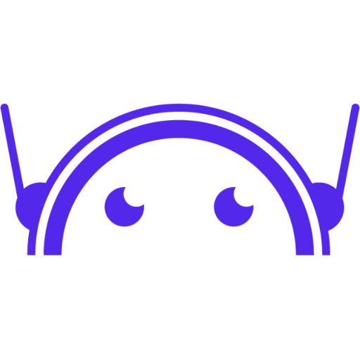

# Lumia - AI Development & Training Platform

Welcome to **Lumia**, a comprehensive platform designed to help developers and AI enthusiasts build, train, and test their artificial intelligence models across a variety of interactive games and classification tasks.

 *(Placeholder for actual logo if available)*

## 🌟 Project Overview

Lumia provides an end-to-end ecosystem where users can download training packages, develop custom AI algorithms, and submit them to be executed and evaluated in isolated, secure cloud environments. 

Whether you're training an AI to master **Connect 4**, conquer **Snake**, or accurately perform **Image Recognition**, Lumia provides the infrastructure, the game logic, and the analytics to track your progress.

### Core Architecture

The Lumia platform is built on a modern, microservices-oriented architecture:

1. **[Lumia Frontend](./lumia-front/lumia/)**: A responsive, rich user interface built with **React**, TailwindCSS, and Material UI. It serves as the portal for users to upload their scripts, view game logs, and track AI performance.
2. **[Lumia Backend](./back-end-lumia/)**: A robust **Spring Boot (Java 21)** application that manages user authentication (OAuth2), database interactions (MongoDB), and orchestrates communication via WebSockets and REST APIs.
3. **[Cluster Manager](./clustermanager/)**: The beating heart of the AI execution engine. Built with **Python (FastAPI)**, it manages Docker containers on-the-fly, creating isolated environments to safely run and train user-submitted AI scripts.
4. **[Training Packages](./training-packages/)**: A collection of Python-based starter kits for various games (Connect4, Snake, Image Recognition). These packages contain the game logic, server communication templates, and documentation to help users jumpstart their AI development.

---

## 🚀 Getting Started

To run the entire Lumia ecosystem locally, we use Docker Compose to spin up the frontend, backend, and the MongoDB database. 

### Prerequisites
- Docker & Docker Compose
- Maven (for backend local development)
- Node.js & npm (for frontend local development)

### Running via Docker Compose

1. Clone the repository and navigate to the root directory.
2. Create necessary environment variable files (e.g., `.env` in the root and in respective subdirectories as needed).
3. Run the following command to build and start the containers:
   ```bash
   docker-compose up --build
   ```
4. Access the application:
   - **Frontend**: `http://localhost:8080`
   - **Backend API**: `http://localhost:8000`
   - **Database**: `mongodb://localhost:27017`

*Note: The Cluster Manager has its own specific setup requirements (see its respective documentation) as it acts as a container orchestrator itself.*

---

## 📚 Documentation Directory

For deep dives into each component, please refer to their respective `README.md` files:

- 🎨 [Frontend Documentation](./lumia-front/lumia/README.md)
- ⚙️ [Backend Documentation](./back-end-lumia/README.md)
- 🐳 [Cluster Manager Documentation](./clustermanager/readme.md)
- 🎮 [Training Packages Guide](./training-packages/README.md)

---

## 🛠️ Contributing & Development

Lumia is designed to be extensible. Want to add a new game? 
1. Create a new game logic script in the `training-packages/` directory.
2. Update the `clustermanager/DeliveringQueue/Game-Vault` to include the game runner.
3. Add the corresponding UI components in the React frontend.

Happy training, and may your AI conquer the leaderboard!
